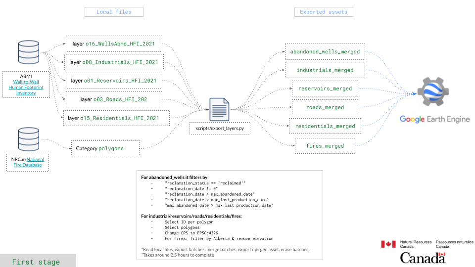
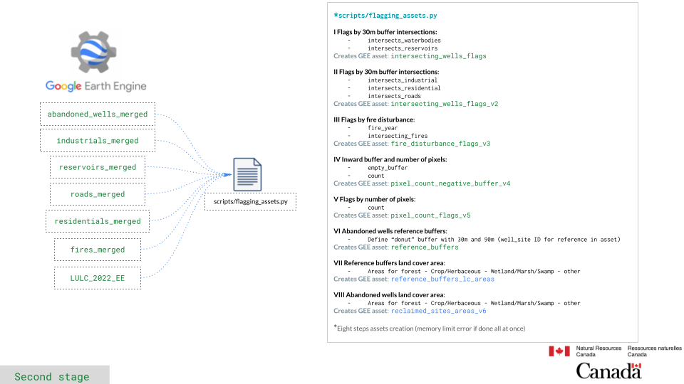
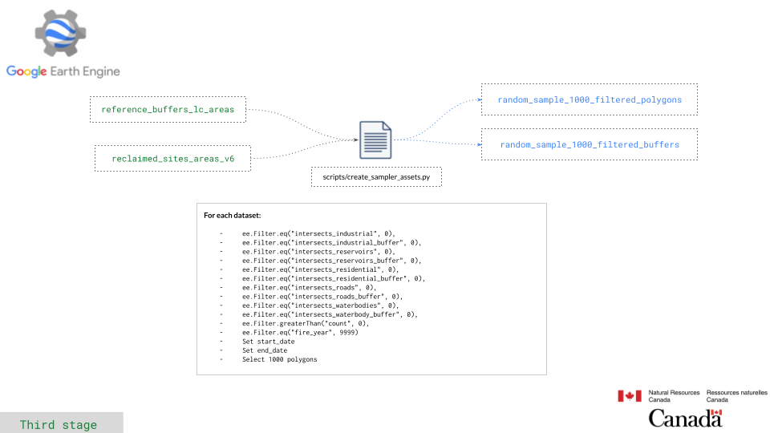

# Derivation of Indicators from Satellite Observations of Vegetation Essential Climate Variables Reclaimed Well and Mine Sites in Alberta, Canada


:warning: This is a work in progress. Expect frequent changes to the code and functionality.

:globe_with_meridians: https://ronnyhdez.github.io/reclaimed_sites_ab/

## Datasets

| Dataset                                                                                                                                                           | URL                                                                                                                                                                                                                                     |
| ----------------------------------------------------------------------------------------------------------------------------------------------------------------- | --------------------------------------------------------------------------------------------------------------------------------------------------------------------------------------------------------------------------------------- |
| The 2020 land cover classification of Alberta (Sentinel-2)                                                                                                        | https://ags.aer.ca/publication/dig-2021-0019 (EE Asset 2022: projects/ee-eoagsaer/assets/LULC_2022_EE, please see the AGS link for description of classes; the metadata of the AGS DIG includes process steps and accuracy assessments) |
| Abandoned well site data with reclamation status is publicly available for download from the ABMI dataset; this one has the construction and reclamation date too | https://abmi.ca/home/data-analytics/da-top/da-product-overview/Human-Footprint-Products/HF-inventory.html (use year 2021 and class 16 - abandoned wellsites)                                                                            |
| Canada National Fire database                                                                                                                                     | https://cwfis.cfs.nrcan.gc.ca/datamart/download/nfdbpoly                                                                                                                                                                                |

## Repository structure

Repository is organize in:

```
reclaimed_sites_ab/
├── leaftoolbox/
│   ├── __init__.py
│   ├── leaf.py
│   ├── module1.py
│   ├── module2.py
├── notebooks/
│   └── abandoned_wells.qmd
│   └── gee_filtering.qmd
│   └── land_cover.qmd
│   └── leaf_process.qmd
│   └── negative_buffer_check.qmd
│   └── reference_buffers.qmd
├── data/
│   └── dataset.csv
├── scripts/
│   └── create_sampler_assets.py
│   └── download_data.py
│   └── flagging_assets.py
│   └── run_polygons_date_filter.py
│   └── run_sampler.py
│   └── shp_exports_for_assets.py
├── utils/
│   ├── __init__.py
│   ├── utils.py
├── .gitignore
├── README.md
└── Pipfile
```

- leaftoolbox: Modules
- notebooks: Documented analysis and data exploration
- scripts: Code to generate assets in GEE

## Data Pipeline

This project involves several stages to process and analyze data
effectively.

### 0. Download Data

The pipeline begins with downloading the necessary datasets.
Run the script `scripts/download_data.py` to retrieve all
the datasets required for the analysis.

### 1. Export Assets to Google Earth Engine (GEE)

The **first stage** of the data pipeline involves exporting
the processed assets to Google Earth Engine (GEE). All
the compute processing will be done in GEE.



### 2. Flagging assets

The **second_stage** consist of several steps to
flag the data. These flags will help later for filtering
the abandoned wells, which will later be used with
the LEAF-toolbox sampler.to be used with LEAF-toolbox sampler



### 3. Create sampler assets

This third stage will take the flagged assets and based on
the research objectives, will filter polygons accordingly.
The resulting assets will be used finally to run the
LEAF-toolbox



## Running the code

[WIP dev notes](https://github.com/ronnyhdez/reclaimed_sites_ab/wiki/Dev-notes)

In summary, steps to recreate the results:

- Create first assets in GEE with `scripts/export_assets.py`
- Flag assets and create buffers with `scripts/flagging_assets.py`
- Prepare the asset to be sample with LEAF-toolbox: `scripts/create_sampler_asset.py`
- Run the LEAF-toolbox sampler on selected abandoned wells: `scripts/run_sampler.py`
- Read the pkl files and check time series in `abandoned_wells_leaf_toolsbox.qmd`

# References

Alberta Biodiversity Monitoring Institute and Alberta Human Footprint Monitoring
Program. ABMI Human Footprint Inventory (HFI) for Alberta 2021 (version 1.0).
Geodatabase. Last modified August 1, 2023.

Canadian Forest Service. 2021. Canadian National Fire Database – Agency Fire Data.
Natural Resources Canada, Canadian Forest Service, Northern Forestry Centre,
Edmonton, Alberta. https://cwfis.cfs.nrcan.gc.ca/ha/nfdb

Chowdhury, S. (2021): Land-use/Land-cover classification of Alberta, derived from
2020 sentinel-2 multispectral data (image data, TIFF format); Alberta Energy
Regulator / Alberta Geological Survey, AER/AGS Digital Data 2021-0019.

Fernandes, R. et al., 2021, "LEAF Toolbox", Canada Centre for Remote Sensing,
https://github.com/rfernand387/LEAF-Toolbox/wiki, DOI: 10.5281/zenodo.4321298.
