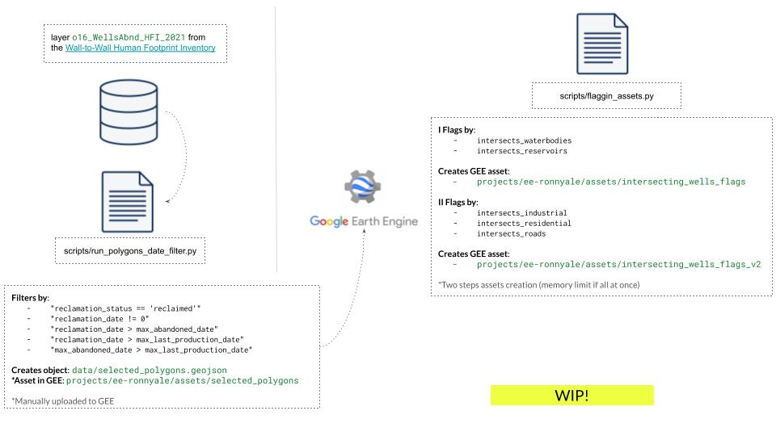

# Derivation of Indicators from Satellite Observations of Vegetation Essential Climate Variables Reclaimed Well and Mine Sites in Alberta, Canada 

 

:warning: This is a work in progress. Expect frequent changes to the code and functionality.

:globe_with_meridians: https://ronnyhdez.github.io/reclaimed_sites_ab/

## Datasets

| Dataset | URL |
| ------- | ----|
| NRCan land cover and land change data based on Landsat 1985-2020 | https://opendata.nfis.org/mapserver/nfis-change_eng.html |
| AAFC land cover data | https://developers.google.com/earth-engine/datasets/catalog/AAFC_ACI#bands |
| The 2020 land cover classification of Alberta (Sentinel-2) | https://ags.aer.ca/publication/dig-2021-0019  (EE Asset 2022: projects/ee-eoagsaer/assets/LULC_2022_EE, please see the AGS link for description of classes; the metadata of the AGS DIG includes process steps and accuracy assessments) |
| Abandoned well site data with reclamation status is publicly available for download from the ABMI dataset; this one has the construction and reclamation date too | https://abmi.ca/home/data-analytics/da-top/da-product-overview/Human-Footprint-Products/HF-inventory.html (use year 2021 and class 16 - abandoned wellsites) |
| Alberta Ground Cover Classification 2000 | https://open.alberta.ca/opendata/gda-f2fcfcfb-e3e6-4c00-a338-c90083c58b7e |
| EE fire data | https://developers.google.com/earth-engine/datasets/catalog/FIRMS (https://developers.google.com/earth-engine/datasets/tags/fire) |
| National fire database | https://cwfis.cfs.nrcan.gc.ca/ha/nfdb | 
| much more recent Alberta Wetland Inventory dataset (based largely on Sentinel), which maps wetland classes across the province | https://abmi.ca/home/data-analytics/da-top/da-product-overview/Advanced-Landcover-Prediction-and-Habitat-Assessment--ALPHA--Products/ABMI-Wetland-Inventory.html |

## Filtering steps

## Running the code

[WIP dev notes](https://github.com/ronnyhdez/reclaimed_sites_ab/wiki/Dev-notes)
